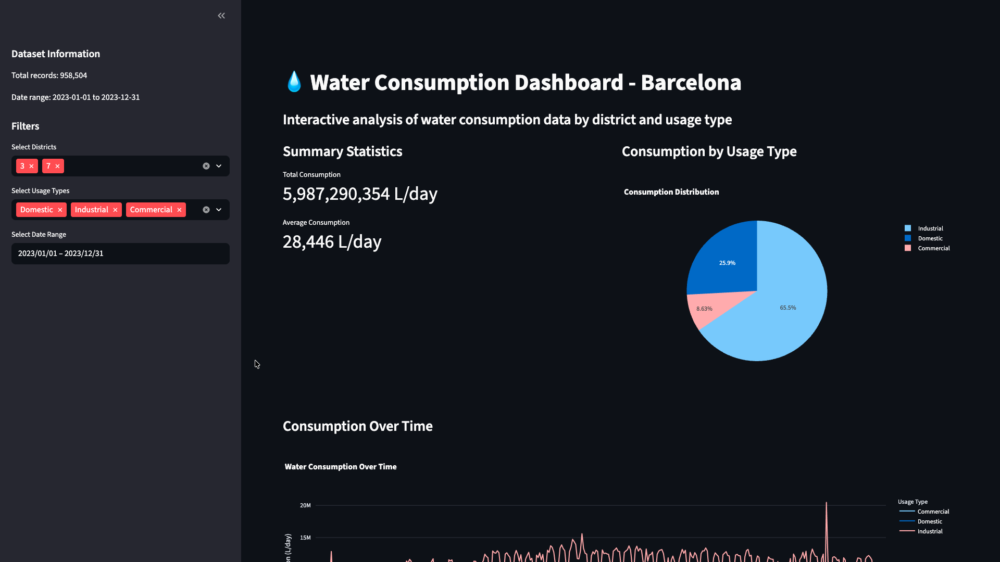
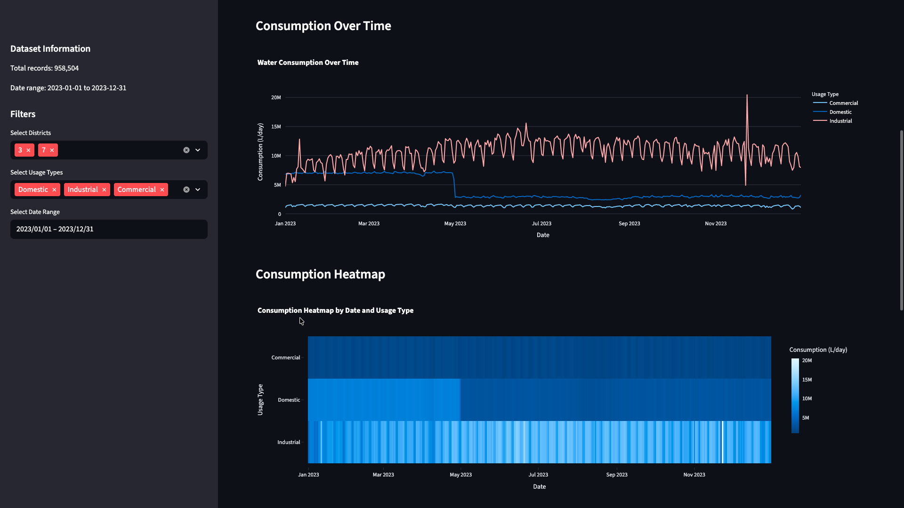
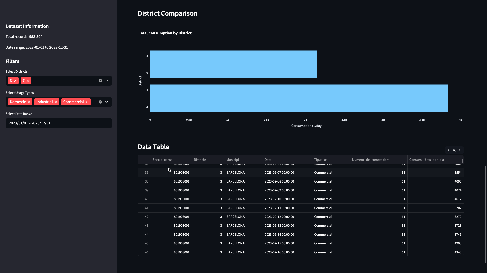
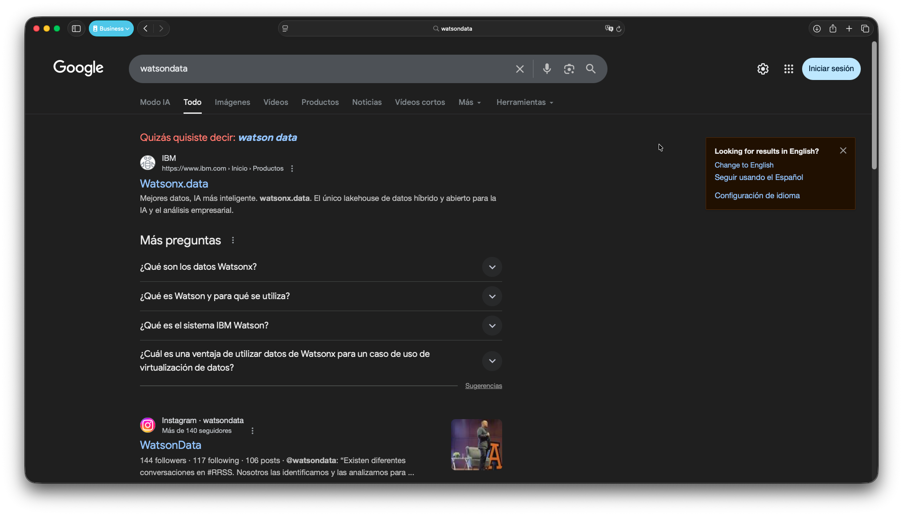
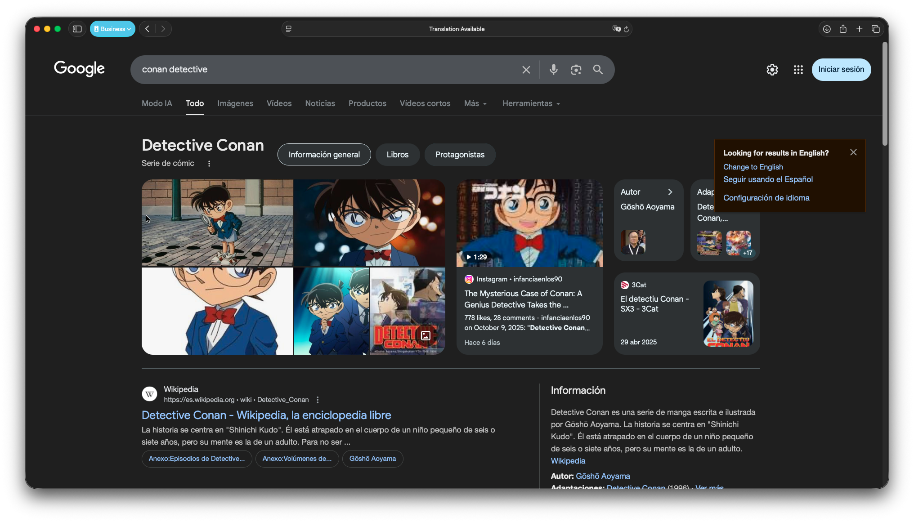

# 💧 Water Consumption Analytics Dashboard

**Barcelona Water Usage Intelligence Platform**

*Powered by Conan Data - Data Consultancy*

---

## 🚀 Overview

Transform your water consumption data into actionable insights with our cutting-edge analytics platform. Built for Barcelona's water management professionals, this dashboard combines the elegance of Apple design with the innovation of Tesla engineering.



### ✨ Key Features

- **Real-time Analytics**: Interactive dashboards with live data visualization
- **Smart Filtering**: District-based and usage-type filtering capabilities
- **Predictive Insights**: Advanced time-series analysis and consumption patterns
- **Export Ready**: Professional reports for stakeholders and decision makers
- **Responsive Design**: Seamless experience across all devices



## 📊 What You'll Discover

- **Consumption Patterns**: Daily, weekly, and seasonal trends
- **District Comparison**: Comprehensive analysis across Barcelona districts
- **Usage Categories**: Commercial, Domestic, and Industrial consumption breakdown
- **Efficiency Metrics**: Performance indicators and optimization opportunities



## 🛠 Quick Start

### Prerequisites

```bash
Python 3.8+
pip package manager
```

### Installation

1. **Clone the repository**
   ```bash
   git clone <repository-url>
   cd datadonsaloocupacio
   ```

2. **Install dependencies**
   ```bash
   cd app
   pip install -r requirements.txt
   ```

3. **Launch the dashboard**
   ```bash
   streamlit run app.py
   ```

4. **Open your browser**
   ```
   http://localhost:8501
   ```

## 📁 Data Structure

Our platform supports CSV files with the following structure:

| Column                | Description           | Type     |
| --------------------- | --------------------- | -------- |
| Seccio_censal         | Census Section        | String   |
| Districte             | District ID           | Integer  |
| Municipi              | Municipality          | String   |
| Data                  | Date                  | DateTime |
| Tipus_us              | Usage Type            | String   |
| Numero_de_comptadors  | Number of Meters      | Integer  |
| Consum_litres_per_dia | Daily Consumption (L) | Integer  |

### Supported Usage Types
- **Commercial**: Business and retail establishments
- **Domestic**: Residential consumption
- **Industrial**: Manufacturing and industrial facilities

## 🎯 Use Cases

### For Water Utilities
- Monitor consumption patterns across districts
- Identify peak usage periods
- Optimize resource allocation

### For City Planners
- Analyze urban consumption trends
- Plan infrastructure improvements
- Support sustainability initiatives

### For Business Intelligence
- Generate executive reports
- Track KPIs and performance metrics
- Support data-driven decisions

## 🏗 Architecture

Built with modern technologies for maximum performance:

- **Frontend**: Streamlit with custom CSS
- **Data Processing**: Pandas & NumPy
- **Visualization**: Plotly & Interactive Charts
- **Styling**: Apple-inspired UI/UX

## 📈 Dashboard Features

### Interactive Visualizations
- Time-series consumption charts
- District comparison bar charts
- Usage type distribution pie charts
- Consumption heatmaps

### Advanced Filtering
- Date range selection
- Multi-district filtering
- Usage type categorization
- Real-time data updates

### Export Capabilities
- PDF report generation
- CSV data export
- Chart image downloads
- Executive summaries

## 🔧 Customization

### Adding New Data Sources
1. Place CSV files in the `/app` directory
2. Ensure column structure matches requirements
3. Restart the application

### Styling Modifications
- Edit CSS in `app.py` for custom themes
- Modify color schemes and layouts
- Add custom branding elements

## 📞 Support & Consulting

**Conan Data** - Your Data Intelligence Partner

🏢 **About Us**: Leading Catalan startup specializing in data consultancy and analytics solutions

📧 **Contact**: Available for custom implementations and enterprise solutions

🌐 **Services**:
- Custom dashboard development
- Data strategy consulting
- Analytics implementation
- Training and support

## 🚀 What's Next?

- **AI Integration**: Machine learning predictions
- **Real-time Streaming**: Live data connections
- **Mobile App**: Native iOS and Android applications
- **API Development**: RESTful API for third-party integrations

## 📄 License

This project is developed by Conan Data for demonstration and commercial purposes.

---

*Transforming data into intelligence. One insight at a time.*

**Conan Data** | Barcelona, Catalunya | 2024


## 📸 Screenshots

